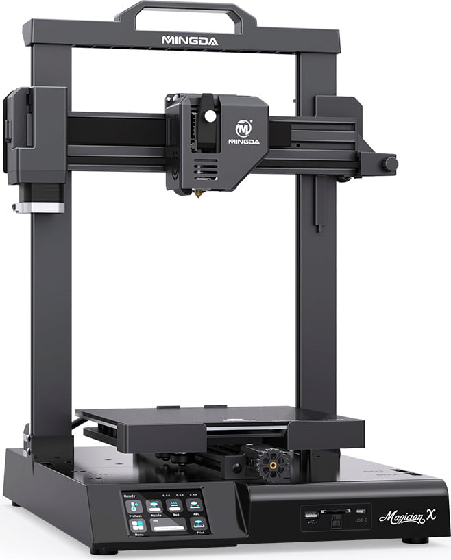

# Mingda Magician X Klipper (MMX)
Klipper for the Mingda Magician X Series ST 407 mainboard

 

## Disclaimer
**THIS IS FOR THE ST MAINBOARD ONLY - USE AT YOUR OWN RISK**

**THIS USES THE USB A PORT**, to connect the printer you will need a USB A - USB A Cable.

Here is an example of an A to A cable:
[img src="https://m.media-amazon.com/images/W/IMAGERENDERING_521856-T1/images/I/51hf51loE8L._AC_SX679_.jpg">](https://www.amazon.com/Monoprice-Male-24AWG-Cable-Plated/dp/B002KKZRYM/ref=sr_1_6?crid=2VWT8AOWJONDZ&keywords=usb+a+to+a&qid=1677765580&sprefix=usb+a+to+%2Caps%2C358&sr=8-6)

**You must block off the 5v pin** on the cable or there will be damage to the Pi or The MMX mainboard.

## Installation
To upload the firmware download the specific bin file and the cfg. Rename the bin to firmware.bin and put it on the sd card. Then upload the printer.cfg and macros.cfg to your klipper instance.

## About the firmware
This is very much an alpha test and requires Klipper and GUI to be working on a Raspberry Pi or equivalent. If you have not tried klipper before; do not attempt this.
The MMX uses a mcu STM32F407ZET6 192k ram 512k cache 168mhz with a custom boot loader, so modifications to the klipper code were needed to make the binary. 
Klipper was configured to use STM32f407 MCU 64k bootloader offset 8mhz clock and usb pa11/pa12 (USB-A) as the config options.
The usb c port is on other pins and more work is needed to get it functional. There is also usart 3 that needs further testing.

Its far from ready but here is whats working and whats not:

**Working**
X&Y movement and homing
Z motion and homing
Extruder & hotend
Heated bed
Independent dual Z with Z tilt
Filament Runout
NeoPixels
Probe

**Not Working:**
TBD

**Not Tested:**
SDcard
Usb C port
Touchscreen (mine is missing)

**Needed:**
Optimize movement
Bed Mesh
Macros

## Credits
Thanks to Josh and Grace for their help
